# Atelier Sécurité des Endpoints et Supervision SIEM

> **Étude de Cas Multi-OS (Linux & Windows) avec Wazuh**

[](https://aws.amazon.com/)
[](https://wazuh.com/)
[](https://ubuntu.com/)
[](https://www.microsoft.com/)

## 📋 Description

Ce projet démontre le déploiement et la configuration d'une plateforme complète de supervision de sécurité utilisant **Wazuh** (SIEM + EDR) dans un environnement cloud AWS. L'infrastructure surveille des endpoints Linux et Windows pour détecter et analyser diverses menaces en temps réel.

## 🎯 Objectifs

- Déployer une architecture de sécurité complète sur AWS
- Implémenter la détection d'intrusions multi-OS
- Démontrer les capacités SIEM et EDR de Wazuh
- Simuler et détecter différents scénarios d'attaque

## 🏗️ Architecture

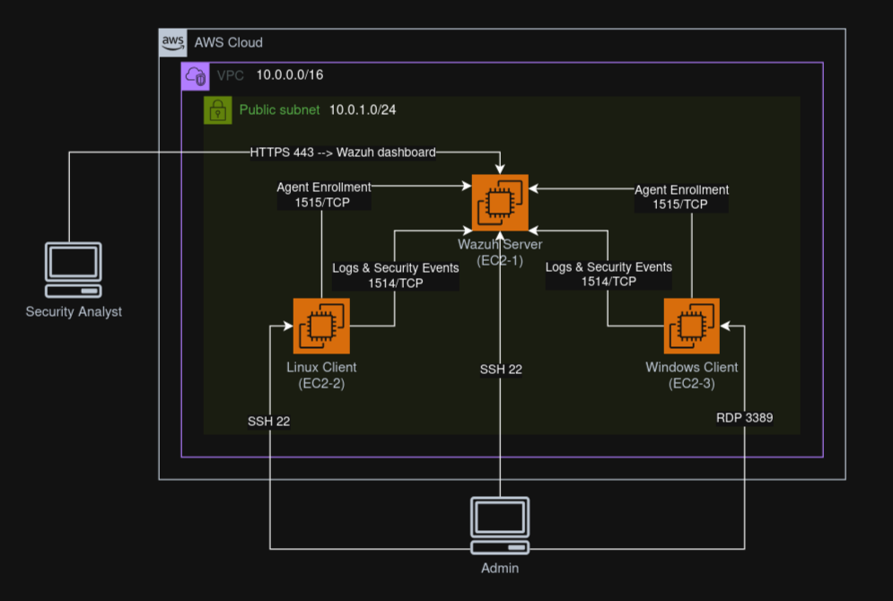

L'infrastructure comprend :
- **Serveur Wazuh** (Ubuntu 22.04) : Manager + Indexer + Dashboard
- **Client Linux** (Ubuntu 22.04) : Agent Wazuh
- **Client Windows** (Windows Server) : Agent Wazuh
- **AWS VPC** avec Security Groups configurés

## 🚀 Installation

### 1. Provisionnement des Instances EC2

#### Configuration du Serveur Wazuh

**Sélection de l'AMI Ubuntu 22.04 LTS :**

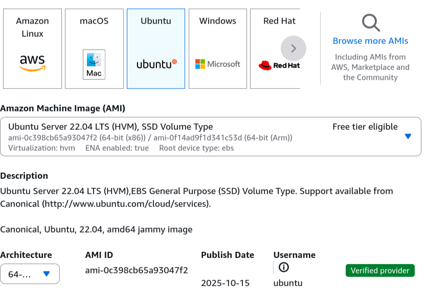

**Configuration du stockage (30 GB) :**

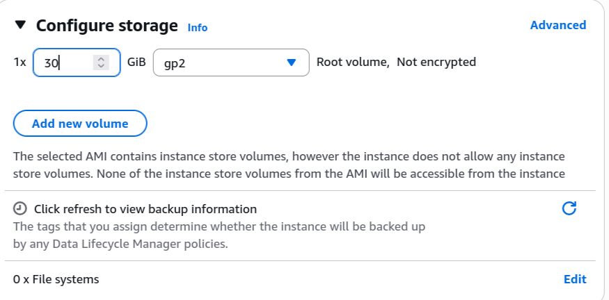

**Association au VPC :**

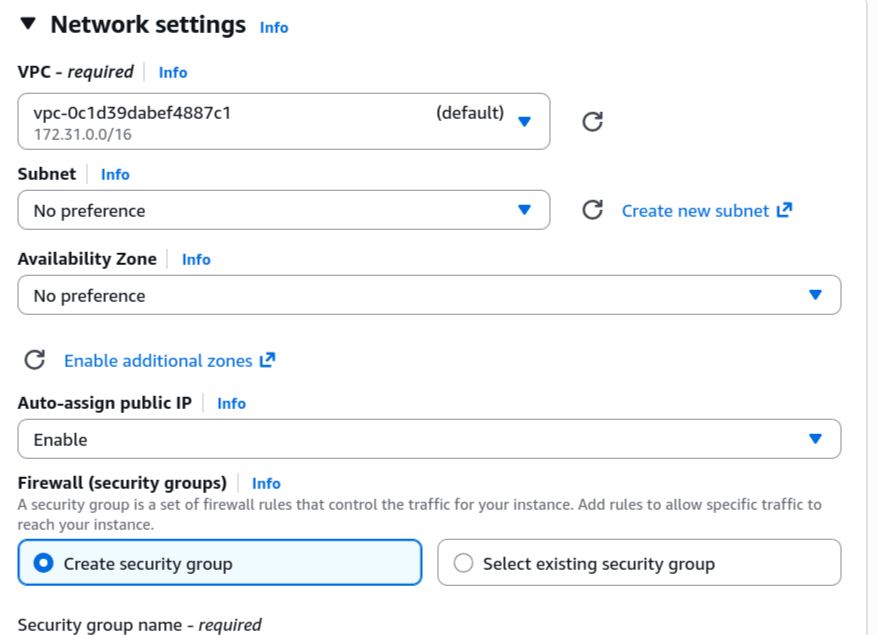

#### Installation de Wazuh

```bash
# Mise à jour du système
sudo apt update && sudo apt upgrade -y
```

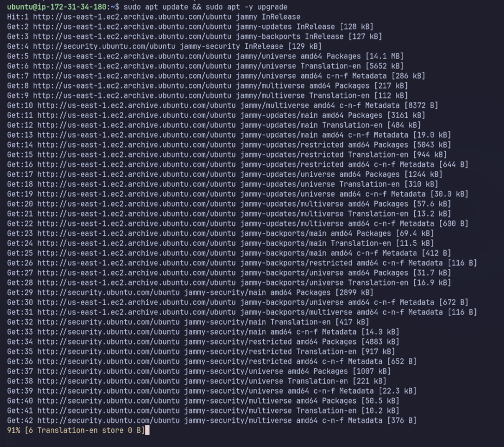

```bash
# Téléchargement du script d'installation
curl -sO https://packages.wazuh.com/4.7/wazuh-install.sh
```

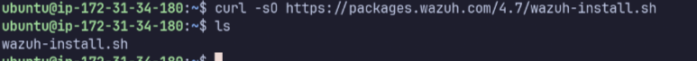

```bash
# Installation complète (Manager + Indexer + Dashboard)
sudo bash wazuh-install.sh -a
```

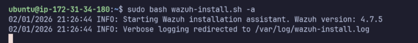


**Accès au Dashboard :**

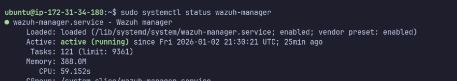

**Vérification des services :**

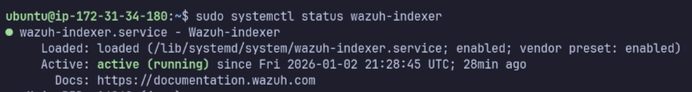

### 2. Déploiement Agent Linux

**Interface de déploiement :**

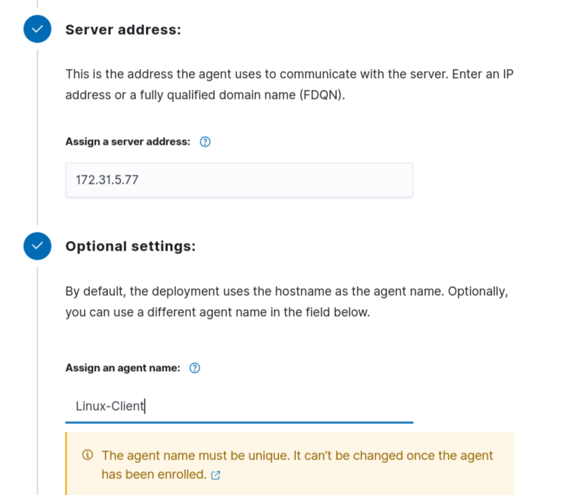

```bash
# Télécharger et installer l'agent
wget https://packages.wazuh.com/4.x/apt/pool/main/w/wazuh-agent/wazuh-agent_4.7.0-1_amd64.deb
sudo dpkg -i wazuh-agent_4.7.0-1_amd64.deb
```

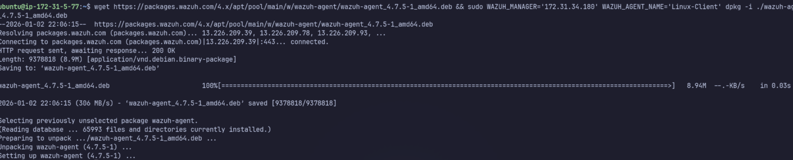

```bash
# Configurer et démarrer
sudo systemctl daemon-reload
sudo systemctl enable wazuh-agent
sudo systemctl start wazuh-agent
```

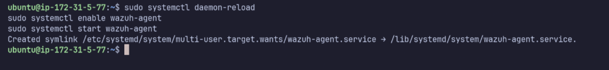

**Agent actif dans le dashboard :**

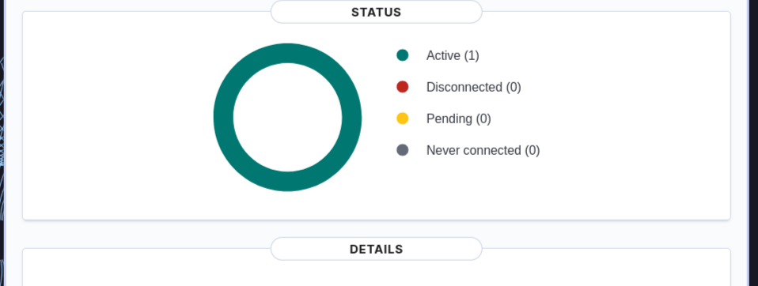

### 3. Déploiement Agent Windows

**Interface de déploiement :**

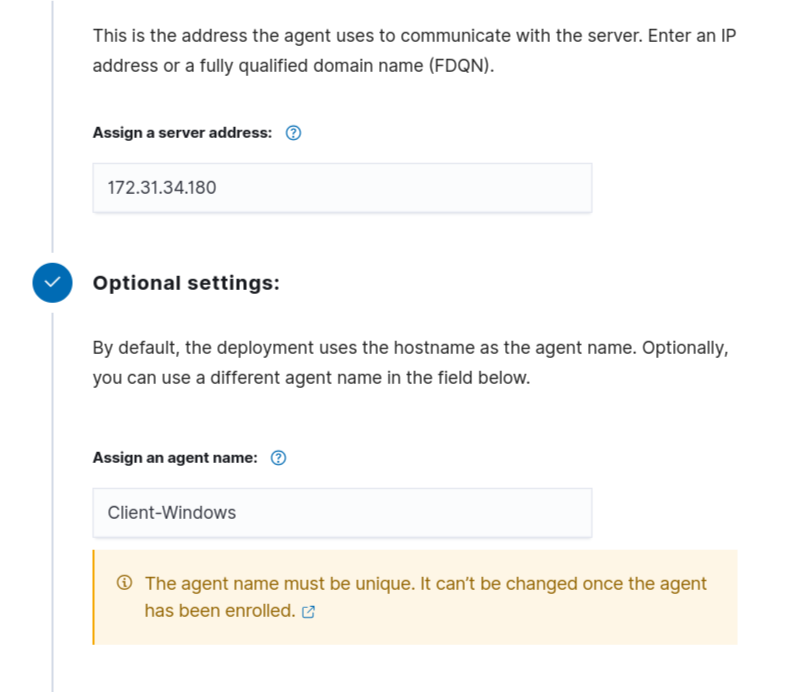

```powershell
# PowerShell en mode Administrateur
Invoke-WebRequest -Uri https://packages.wazuh.com/4.x/windows/wazuh-agent-4.7.0-1.msi -OutFile wazuh-agent.msi

# Installation silencieuse
msiexec.exe /i wazuh-agent.msi /q WAZUH_MANAGER='[IP_SERVEUR]' WAZUH_AGENT_NAME='Windows-Client'
```

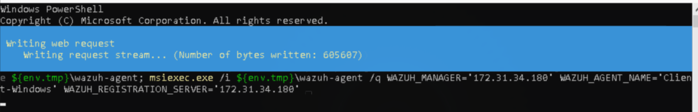

```powershell
# Démarrer le service
NET START WazuhSvc
```

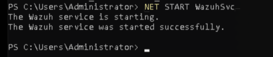

**Agent actif dans le dashboard :**

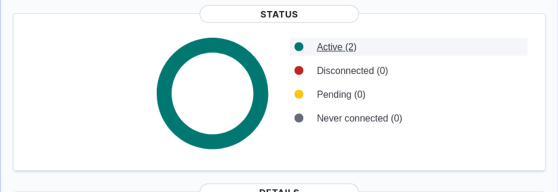

## 🔒 Configuration Réseau

### Security Groups

**Serveur Wazuh :**
- Port 22 (SSH) : Administration
- Port 443 (HTTPS) : Dashboard Web
- Ports 1514-1515 (TCP) : Communication agents

**Clients :**
- Port 22 (Linux) / 3389 (Windows) : Administration
- Sortant vers ports Wazuh du serveur

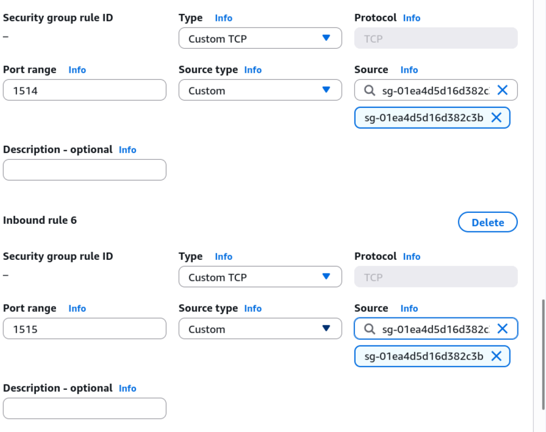

## 🎭 Scénarios de Détection

### 1. Attaque Force Brute SSH

**Simulation de tentatives de connexion répétées :**

```bash
ssh fakeuser@localhost
```

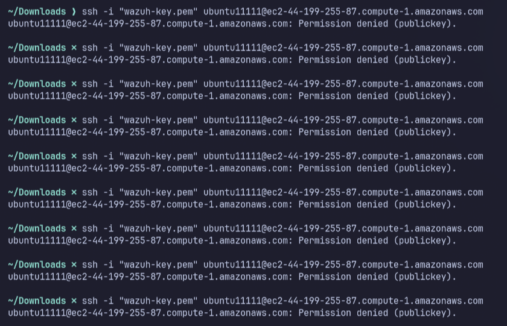

**Alerte générée par Wazuh :**

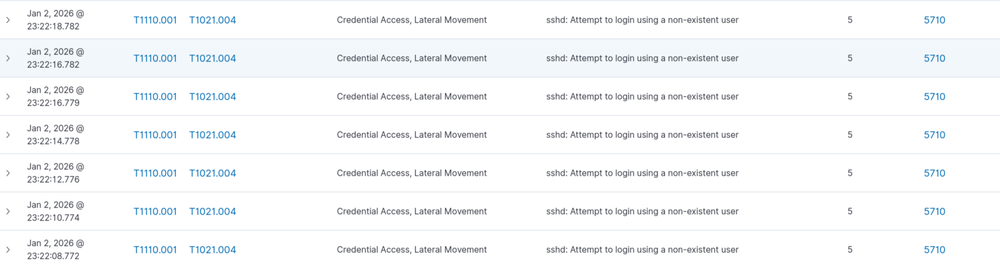

### 2. Escalade de Privilèges

**Commande d'élévation de privilèges :**

```bash
sudo su
```

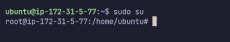

**Alerte de détection :**

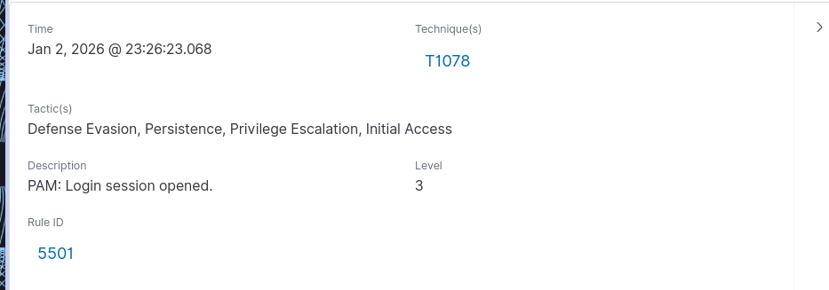

### 3. Modification Fichier Sensible

**Modification du fichier /etc/passwd :**

```bash
echo "test" >> /etc/passwd
```

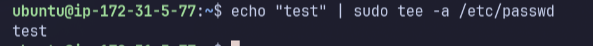

**Alerte File Integrity Monitoring (FIM) :**

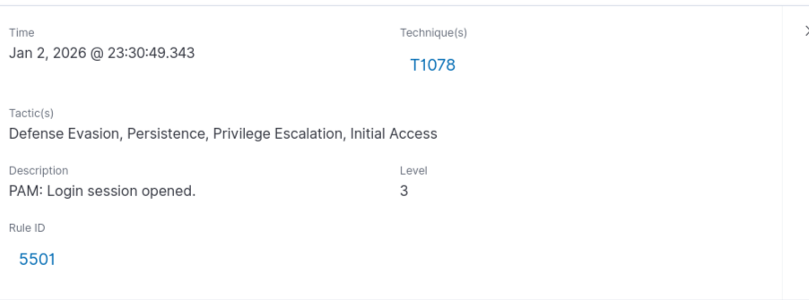

### 4. Gestion Comptes Windows

**Création d'utilisateur et ajout au groupe Administrators :**

```powershell
net user testuser Password123! /add
net localgroup Administrators testuser /add
```

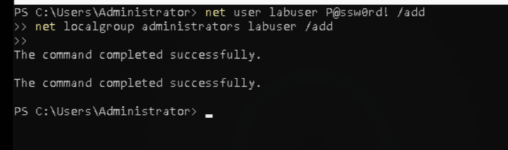

**Alerte de modification de compte :**

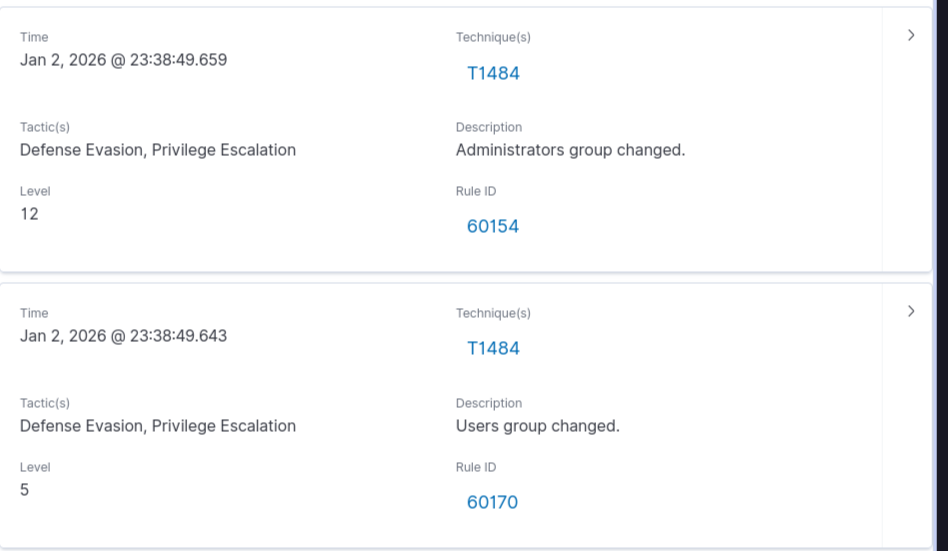

## 📊 Dashboard

Le dashboard Wazuh offre une vue centralisée des événements de sécurité :

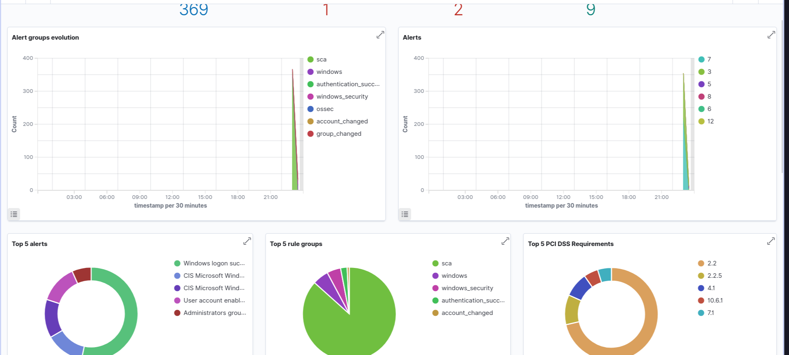

**Fonctionnalités principales :**
- Répartition des alertes par sévérité
- Évolution temporelle des événements
- Agents les plus actifs
- Règles les plus déclenchées

## 🛠️ Technologies Utilisées

| Composant | Version | Rôle |
|-----------|---------|------|
| **Wazuh** | 4.7 | SIEM + EDR |
| **AWS EC2** | - | Hébergement instances |
| **Ubuntu Server** | 22.04 LTS | OS serveur & client Linux |
| **Windows Server** | 2019/2022 | Client Windows |
| **OpenSearch** | - | Indexation des logs |

## 📈 Résultats

✅ Détection en temps réel des menaces  
✅ Surveillance multi-OS fonctionnelle  
✅ Corrélation d'événements efficace  
✅ Interface de visualisation intuitive  
✅ Alertes contextualisées et détaillées  

## 🎓 Compétences Acquises

- Déploiement d'infrastructure de sécurité cloud
- Configuration SIEM/EDR
- Analyse de logs et corrélation d'événements
- Investigation d'incidents de sécurité
- Gestion de Security Operations Center (SOC)

## 📝 Informations Projet

**Étudiant :** Tarik Khoumri  
**Encadrant :** Prof. Azeddine KHIAT  
**Filière :** II-CCN2  
**Année :** 2025/2026

## 🔗 Ressources

- [Documentation Wazuh](https://documentation.wazuh.com/)
- [AWS Security Best Practices](https://aws.amazon.com/security/best-practices/)
- [MITRE ATT&CK Framework](https://attack.mitre.org/)

## 📄 Licence

Ce projet est réalisé dans un cadre pédagogique.

---

⭐ **Note :** Pour plus de détails techniques, consulter le rapport LaTeX complet du projet.
