# Endpoint Security and SIEM Monitoring Workshop

> **Multi-OS Case Study (Linux & Windows) with Wazuh**

[](https://aws.amazon.com/)
[](https://wazuh.com/)
[](https://ubuntu.com/)
[](https://www.microsoft.com/)

---

## 📋 Description

This project demonstrates the deployment and configuration of a complete security monitoring platform using **Wazuh** (SIEM + EDR) in an AWS cloud environment.

The infrastructure monitors both Linux and Windows endpoints to detect and analyze various threats in real time.

---

## 🎯 Objectives

* Deploy a complete security architecture on AWS
* Implement multi-OS intrusion detection
* Demonstrate Wazuh’s SIEM and EDR capabilities
* Simulate and detect different attack scenarios

---

## 🏗️ Architecture

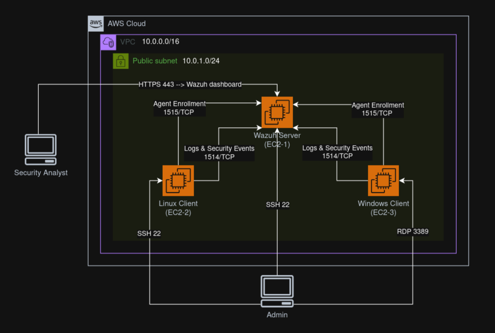

The infrastructure includes:

* **Wazuh Server** (Ubuntu 22.04): Manager + Indexer + Dashboard
* **Linux Client** (Ubuntu 22.04): Wazuh Agent
* **Windows Client** (Windows Server): Wazuh Agent
* **AWS VPC** with configured Security Groups

---

## 🚀 Installation

### 1. EC2 Instance Provisioning

#### Wazuh Server Configuration

**Ubuntu 22.04 LTS AMI selection:**
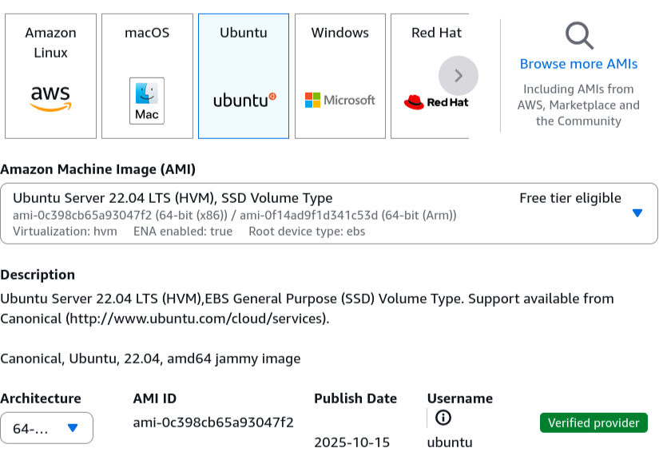

**Storage configuration (30 GB):**
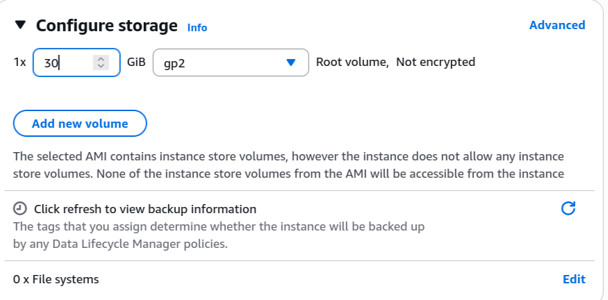

**VPC association:**
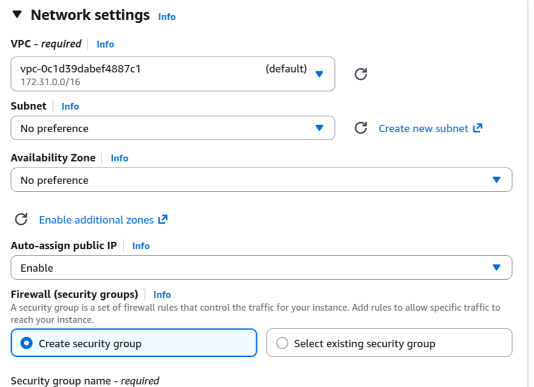

---

#### Wazuh Installation

```bash
# System update
sudo apt update && sudo apt upgrade -y
```

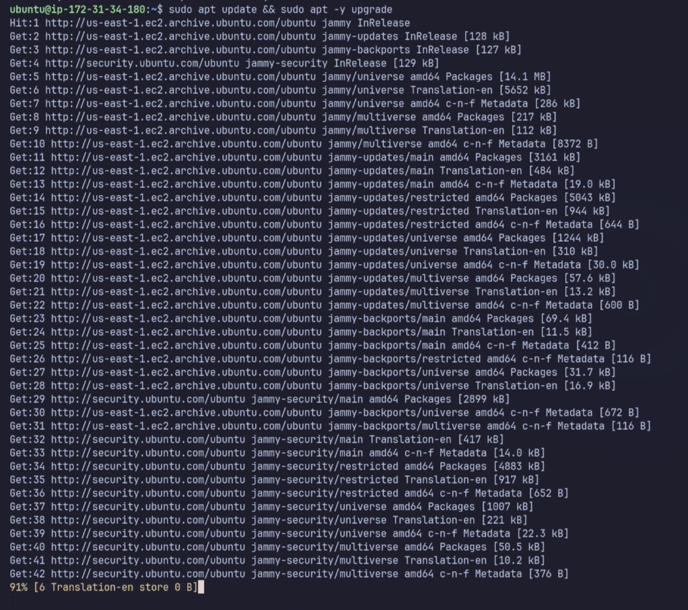

```bash
# Download installation script
curl -sO https://packages.wazuh.com/4.7/wazuh-install.sh
```

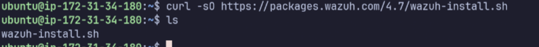

```bash
# Full installation (Manager + Indexer + Dashboard)
sudo bash wazuh-install.sh -a
```

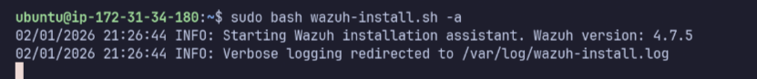
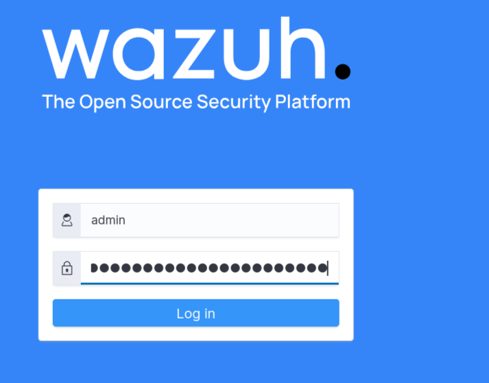

**Dashboard access:**
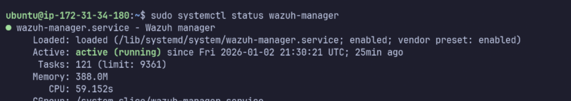

**Service status verification:**
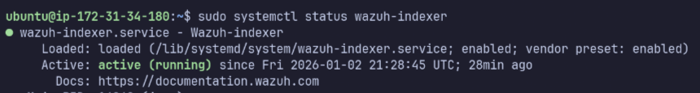

---

### 2. Linux Agent Deployment

**Deployment interface:**
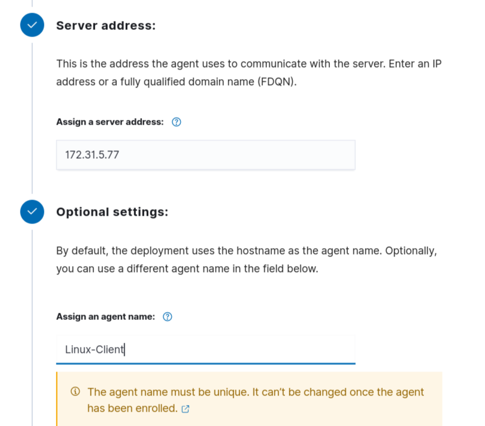

```bash
# Download and install the agent
wget https://packages.wazuh.com/4.x/apt/pool/main/w/wazuh-agent/wazuh-agent_4.7.0-1_amd64.deb
sudo dpkg -i wazuh-agent_4.7.0-1_amd64.deb
```

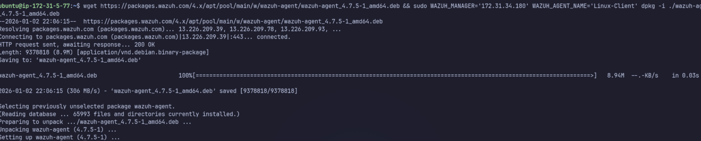

```bash
# Configure and start
sudo systemctl daemon-reload
sudo systemctl enable wazuh-agent
sudo systemctl start wazuh-agent
```

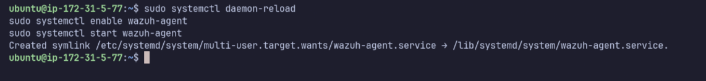

**Active agent in the dashboard:**


---

### 3. Windows Agent Deployment

**Deployment interface:**
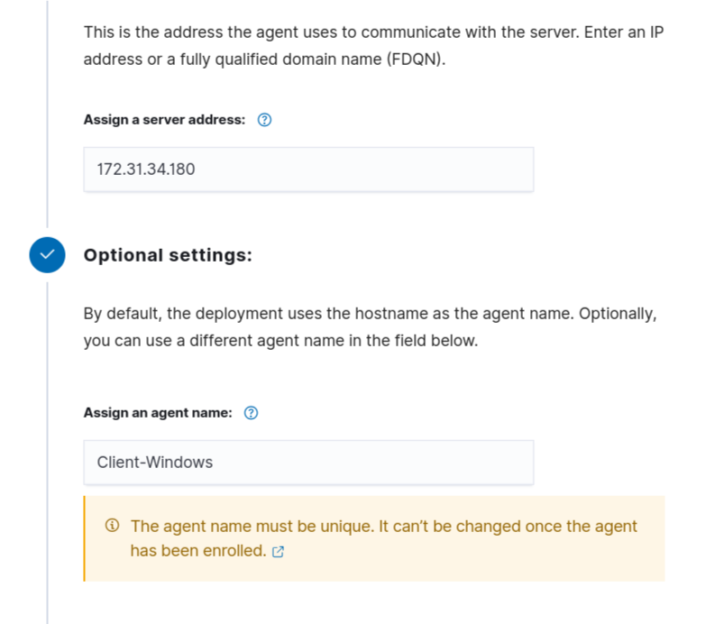

```powershell
# Run PowerShell as Administrator
Invoke-WebRequest -Uri https://packages.wazuh.com/4.x/windows/wazuh-agent-4.7.0-1.msi -OutFile wazuh-agent.msi

# Silent installation
msiexec.exe /i wazuh-agent.msi /q WAZUH_MANAGER='[SERVER_IP]' WAZUH_AGENT_NAME='Windows-Client'
```

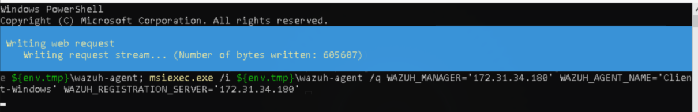

```powershell
# Start the service
NET START WazuhSvc
```

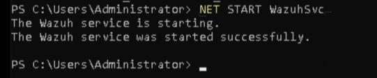

**Active agent in the dashboard:**
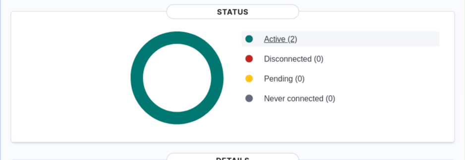

---

## 🔒 Network Configuration

### Security Groups

**Wazuh Server:**

* Port 22 (SSH): Administration
* Port 443 (HTTPS): Web Dashboard
* Ports 1514–1515 (TCP): Agent communication

**Clients:**

* Port 22 (Linux) / 3389 (Windows): Administration
* Outbound access to Wazuh server ports

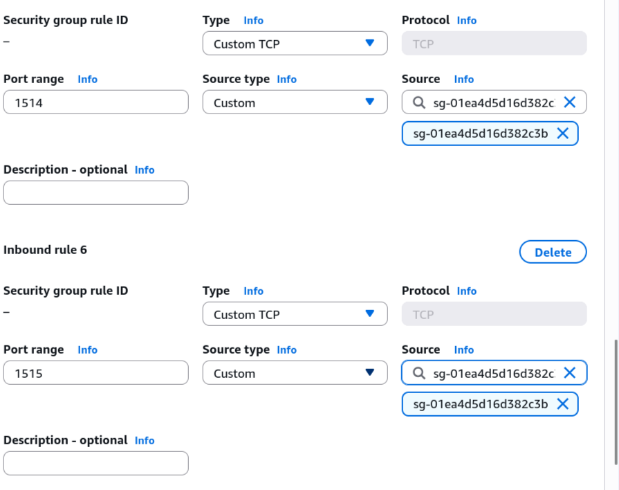

---

## 🎭 Detection Scenarios

### 1. SSH Brute Force Attack

**Simulated repeated login attempts:**

```bash
ssh fakeuser@localhost
```

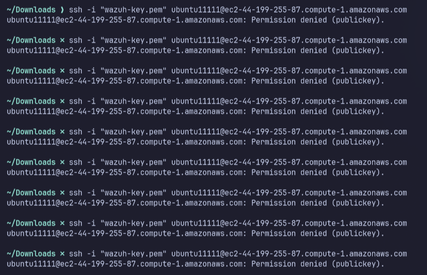

**Alert generated by Wazuh:**
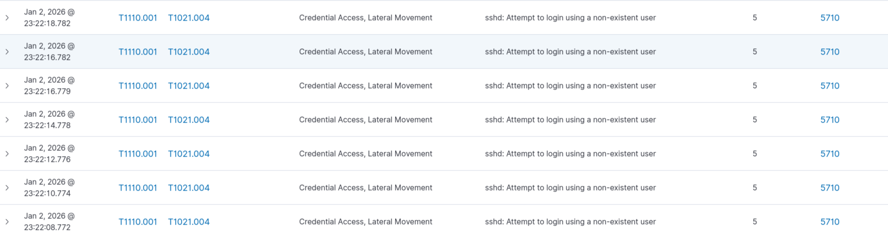

---

### 2. Privilege Escalation

**Privilege elevation command:**

```bash
sudo su
```

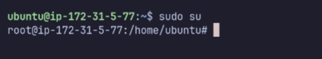

**Detection alert:**
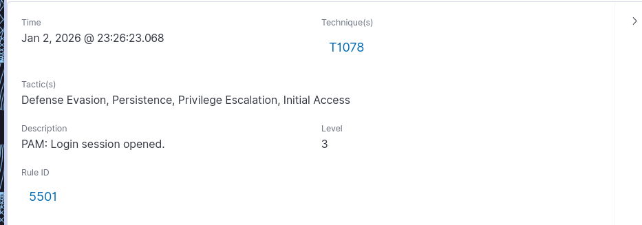

---

### 3. Sensitive File Modification

**Modification of /etc/passwd file:**

```bash
echo "test" >> /etc/passwd
```

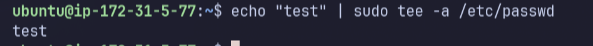

**File Integrity Monitoring (FIM) alert:**
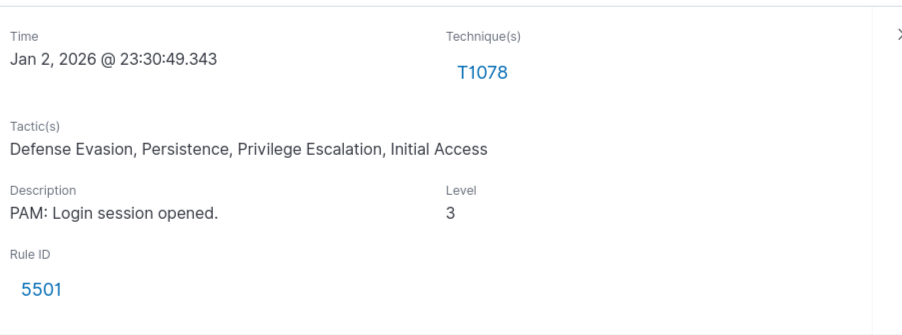

---

### 4. Windows Account Management

**User creation and addition to Administrators group:**

```powershell
net user testuser Password123! /add
net localgroup Administrators testuser /add
```

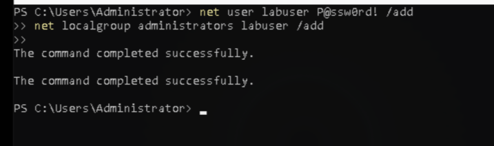

**Account modification alert:**
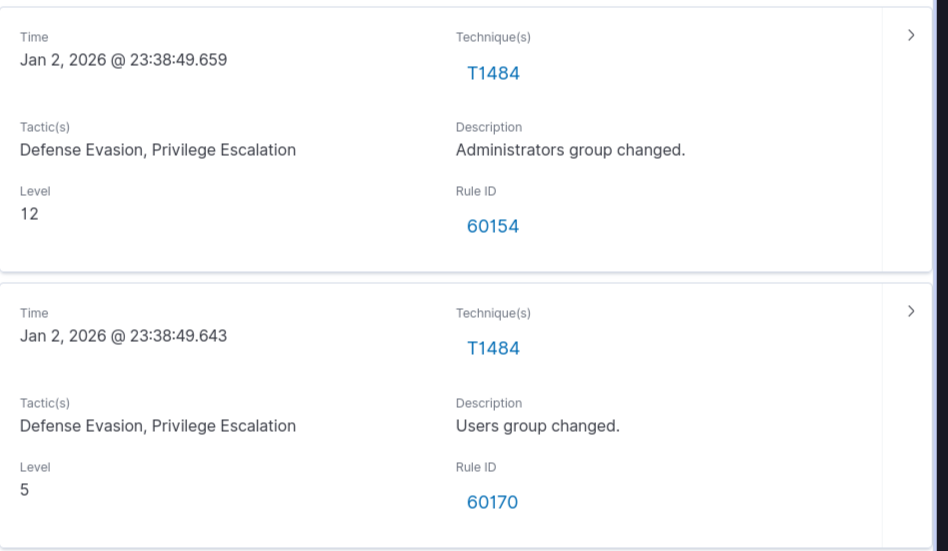

---

## 📊 Dashboard

The Wazuh dashboard provides a centralized view of security events:

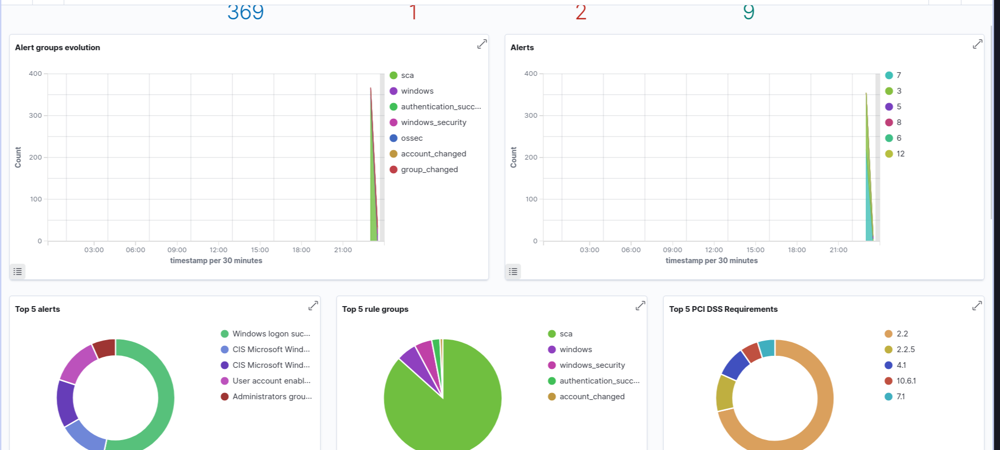

**Main features:**

* Alert distribution by severity
* Event timeline visualization
* Most active agents
* Most triggered rules

---

## 🛠️ Technologies Used

| Component          | Version   | Role                     |
| ------------------ | --------- | ------------------------ |
| **Wazuh**          | 4.7       | SIEM + EDR               |
| **AWS EC2**        | -         | Instance hosting         |
| **Ubuntu Server**  | 22.04 LTS | Server & Linux client OS |
| **Windows Server** | 2019/2022 | Windows client           |
| **OpenSearch**     | -         | Log indexing             |

---

## 📈 Results

* Real-time threat detection
* Functional multi-OS monitoring
* Effective event correlation
* Intuitive visualization interface
* Contextualized and detailed alerts

---

## 🎓 Skills Acquired

* Cloud security infrastructure deployment
* SIEM/EDR configuration
* Log analysis and event correlation
* Security incident investigation
* Security Operations Center (SOC) management

---

## 📝 Project Information

**Student:** Tarik Khoumri
**Supervisor:** Prof. Azeddine KHIAT
**Program:** II-CCN2
**Academic Year:** 2025/2026

---

## 🔗 Resources

* [Wazuh Documentation](https://documentation.wazuh.com/)
* [AWS Security Best Practices](https://aws.amazon.com/security/best-practices/)
* [MITRE ATT&CK Framework](https://attack.mitre.org/)

---

## 📄 License

This project was completed as part of an academic program.
